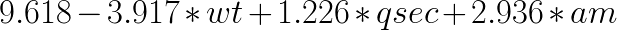
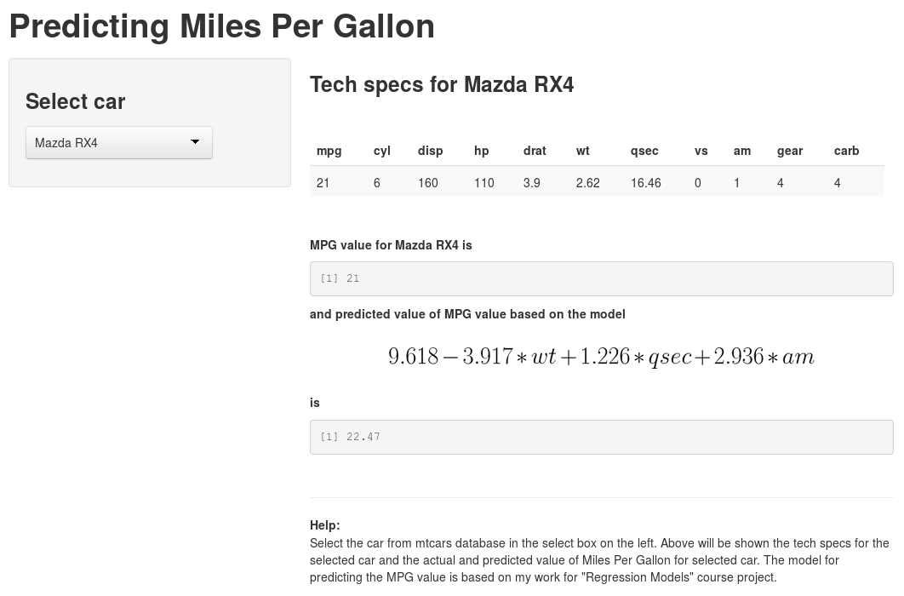

---
title       : Predicting Miles Per Gallon
subtitle    : 
author      : frajer
output      : ioslides_presentation
mode        : self-contained
--- 

<style>

.title-slide hgroup > h1,
.title-slide hgroup > h2 {
    color:  #00BFFF;
}

slide.segue h2{
    color: #00BFFF;
}
slide:not(.segue) h2{
    color: #00BFFF;
}
</style>

## ShinyApps purpose
<br>

1. Showing tech specs for specifed car

2. Showing actual MPG value for specifed car

3. Showing predicted MPG value for specifed car


## Predicting formula
<br>

* The model for predicting the MPG value is based on my work for "Regression Models" course project.

* The formula for the model is: 
<div style='text-align: center;'>
    <br>
    
</div>


## App screenshoot




## Calculating predicted value for the car on previous slide

```{r, results='asis', echo=TRUE}
techs <- function(car) mtcars[car,]
car <- "Mazda RX4"
round(9.618-3.917*techs(car)$wt+1.226*techs(car)$qsec
      +2.936*techs(car)$am,digits=2)
```

